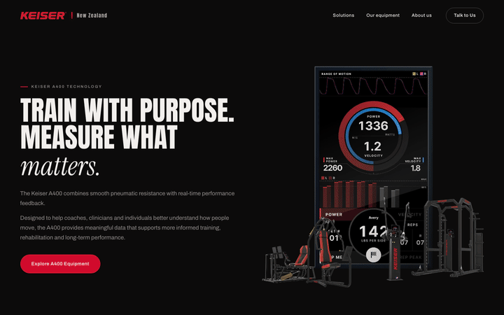
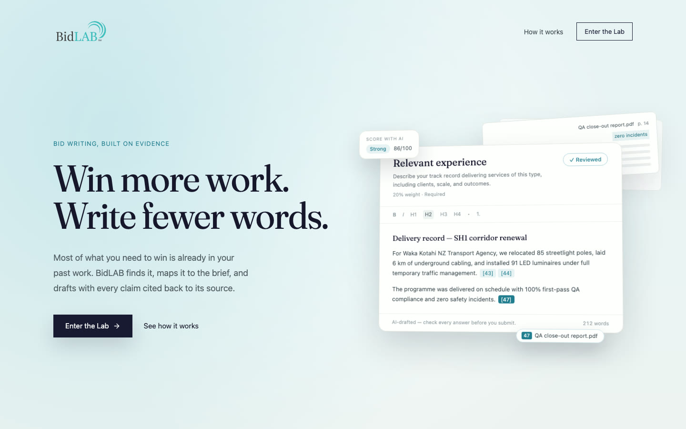

I'm a software engineer at [Spotto](https://spotto.ai) in Auckland. I build tools I actually use, mostly with AI agents.

<table>
  <tr>
    <td width="50%" valign="top">
      
       <b><a href="https://github.com/ethangreeney/ai-analysis">AI Bench</a></b>
       Which AI model should you actually use?
    </td>
    <td width="50%" valign="top">
      
       <b><a href="https://github.com/ethangreeney/atlas">Atlas</a></b>
       Learn every flag, capital and map.
    </td>
  </tr>
  <tr>
    <td width="50%" valign="top">
      
       <b><a href="https://github.com/ethangreeney/rev-match-gauge">Rev-match gauge</a></b>
       A dash gauge that grades my downshifts.
    </td>
    <td width="50%" valign="top">
      
       <b><a href="https://github.com/ethangreeney/kindle-usage-ledger">Kindle usage ledger</a></b>
       My Claude and Codex limits, live on my desk.
    </td>
  </tr>
  <tr>
    <td width="50%" valign="top">
      
       <b>Keiser New Zealand</b> <code>Private client work</code>
       A new website, showroom TV app and quote builder for Keiser’s New Zealand distributor.
    </td>
    <td width="50%" valign="top">
      
       <b>BidLab</b> <code>Private client work</code>
       Drafts tender answers from your past work and cites every claim. My AUT capstone, built for Write Impact.
    </td>
  </tr>
</table>

[LinkedIn](https://www.linkedin.com/in/ethan-greene-nz) · [ethan@greene.nz](mailto:ethan@greene.nz)
